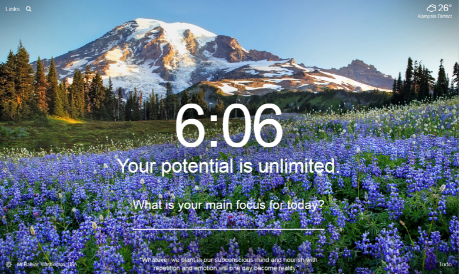

# Qraft-Digital-Art
> Productivity tool for scheduling tasks, creating to do lists, displaying wallpapers and an inspirational quote every day.

    This is a productivity tool that helps beat procrastination, keep the user focused and motivated through his/her daily activities. This tool will be developed to become a chrome extension that runs on the chrome browser dominating the entire chrome window everytime a new tab is created.

Some of the Functionalities to be added.
* A todolist to keep track of tasks.
* Links and search bar for search queries to be submit to a search engine
* Timer/Clock to show the time and also set a pomodoro timer for tasks.
* Avail whether updates based on the users geographical location.
* Set a new background inspirational photo and quote each day.

    Inspiration is drawn from the [Momentum Dashboard](https://momentumdash.com/) extension illustrated in the image below.

